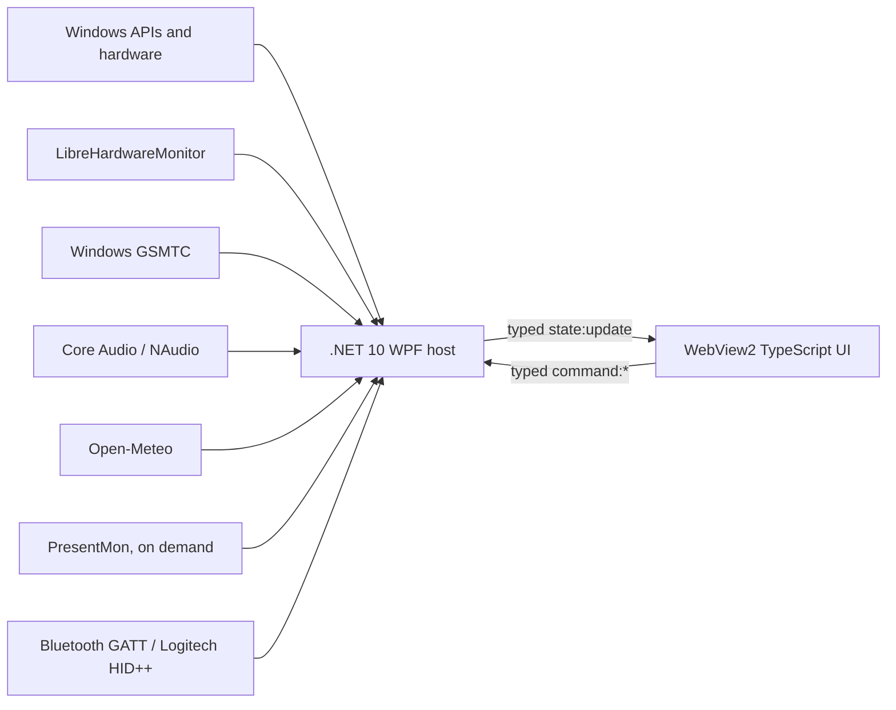

# OpenPanel


[](https://github.com/KD-DC/OpenPanel/actions/workflows/ci.yml)
[](LICENSE)
[](#requirements)
[](https://github.com/KD-DC/OpenPanel/releases/latest)

OpenPanel is an open-source, Windows-native touchscreen dashboard for 1920 x 550
secondary displays. It is developed for the ASUS ProArt PA147CDV and is suitable
for similarly sized ultrawide displays such as the Corsair XENEON EDGE.

The application combines live PC telemetry, Windows media controls, audio-device
switching, weather, and air quality in a low-overhead interface designed to stay
visible on a dedicated display.

> [!IMPORTANT]
> OpenPanel is under active development. Preview releases are usable but may
> change settings and layout behavior between versions.

## Download

Download the latest `OpenPanel-Setup-*.exe` from
[GitHub Releases](https://github.com/KD-DC/OpenPanel/releases/latest).

The installer:

- Installs for the current user without administrator access.
- Bundles the .NET 10 Desktop runtime.
- Adds OpenPanel and its uninstaller to the Start Menu.
- Offers optional startup and desktop shortcuts, both off by default.
- Preserves settings under `%LOCALAPPDATA%\OpenPanel` across upgrades.

OpenPanel releases are not yet Authenticode-signed, so Microsoft Defender
SmartScreen may show an unrecognized-app warning. Each release includes a
`.sha256` checksum alongside the installer.

## Features

### Touchscreen dashboard

- Borderless 1920 x 550 window that prefers a connected display at that
  resolution and falls back to the primary display.
- Touch swipe, mouse drag, page buttons, and keyboard arrow navigation.
- Mouse and touch activation for widget controls.
- Long-press arrangement mode with drag-and-drop reordering across pages.
- Automatic page creation at the right edge and removal of empty pages.
- Persistent widget order and compact/expanded Media sizing.
- Tray-only operation with no taskbar button.
- OLED-first dark appearance plus the earlier `Current` appearance for
  comparison.

### Widgets

| Widget | Current information and controls |
| --- | --- |
| Hardware | CPU/GPU utilization and temperature, RAM/VRAM usage, GPU power and fans, live network rates, plus an on-demand expanded view of the top applications by CPU and working-set memory |
| Network Quality | On-demand latency, jitter, packet loss, link speed, interface, and local-address diagnostics |
| Peripheral Batteries | Numeric battery state for compatible Bluetooth devices and Logitech mouse/keyboard devices through read-only HID++ or the existing Logi Options+ agent; descriptive states are shown when Options+ exposes only coarse levels |
| Gaming | Manually activated FPS, frame time, 1% low, GPU busy time, and stutter count using PresentMon |
| Media | Artwork, source, title, artist, playback state, timeline, previous, play/pause, next, seek, and shuffle when supported |
| Audio | Stable output-device list, default-output switching, global volume, mute, and activity |
| Memory | Physical used/available/installed memory and committed-memory usage |
| CPU Performance | Load, average clock, package power, package temperature, and sensor availability |
| GPU Performance | Core clock, memory clock, fan control, and sensor availability |
| GPU Thermals | Hot-spot and memory-junction temperatures when exposed |
| Storage | Capacity, activity, temperature, and read/write rates for detected fixed drives |
| Weather | Current conditions, daily high/low, feels-like temperature, humidity, wind, and U.S. AQI |

Media, Weather, Hardware application usage, and the Hardware network section can expand for more detail. Compact Media occupies
one standard widget width; expanded Media returns to its larger artwork-focused
layout while surrounding widgets automatically reflow.

The system tray **Widgets** submenu controls which widgets appear. Every widget
is enabled by default, and only disabled widget IDs are persisted, so newly
added widgets appear automatically after an update.

### Media integration

OpenPanel uses Windows
`GlobalSystemMediaTransportControlsSessionManager` (GSMTC), so Spotify OAuth and
the Spotify Web API are not required. It prefers an actively playing Spotify
session, then other playing or recently controlled sessions.

Available metadata depends on the media application. OpenPanel can display
artwork, album, album artist, genre, track position, track count, playback type,
shuffle, repeat, and playback rate when the selected session publishes them.
Artwork is cached and is not resent on every telemetry update.

### Audio control center

The compact Audio widget controls the Windows multimedia default output,
endpoint volume, and mute state. The expanded control center adds:

- Active microphone selection, volume, mute, and input activity.
- Per-application volume and mute for active sessions on the current output.
- Stable alphabetical endpoint ordering so selecting an output does not move
  its button.
- Live refresh when Bluetooth, USB, and other audio devices connect or
  disconnect.

Output switching is global. OpenPanel does not implement per-application output
routing.

### Weather and air quality

The compact Weather widget shows current conditions, today's high and low, and
AQI, plus rain probability when it is above zero. Expanded mode adds hourly precipitation and temperature, a three-day
forecast, PM2.5, PM10, and ozone.

The host fetches forecast and air-quality data from Open-Meteo without an API
key. Successful responses are cached for 15 minutes; failed refreshes retain the
last valid result and retry after five minutes.

## Architecture

OpenPanel keeps Windows integration in a native host and presentation in a
small bundled web UI.



### Native host

The .NET 10 WPF host owns:

- Display discovery, window placement, system tray behavior, and WebView2.
- Hardware, on-demand process usage, memory, network, storage, media, audio, and weather services.
- Normalization of Windows-specific data into one `DashboardState`.
- Validation and execution of typed commands from the UI.
- Settings and diagnostic logs under `%LOCALAPPDATA%\OpenPanel`.

Default audio-device switching is isolated in
`Interop/AudioPolicyConfig` because Windows exposes endpoint enumeration and
volume publicly but does not provide a fully public default-endpoint setter.

### Dashboard UI

The UI is strict TypeScript, HTML, and CSS bundled by Vite. It deliberately does
not use React, a charting package, or another UI framework. Widget layout and
sizing are persisted in WebView2 local storage.

Host/UI communication is constrained to the typed bridge:

- Host to UI: `state:update`
- UI to host: `command:audio.*`, `command:media.*`,
  `command:hardware.expanded`, `command:network.expanded`,
  `command:gaming.active`, and
  `command:system.ready`

See [Architecture](docs/architecture.md) for additional implementation detail.

## Resource-Conscious Design

Low background overhead is a primary project requirement.

- One non-overlapping one-second host loop collects telemetry, media, and
  compact audio state concurrently.
- Storage sensors are sampled every five seconds.
- Weather is cached for 15 minutes.
- Bluetooth and direct HID++ battery probes refresh at most once every two
  minutes. When Logi Options+ is already installed, OpenPanel reuses its local
  agent through one read-only named-pipe subscription instead of starting
  another hardware process.
- A Windows Bluetooth device watcher requests an immediate refresh when a
  paired Bluetooth LE peripheral connects, changes, or disconnects; it does not
  poll while the system is otherwise idle. A single delayed follow-up after a
  connection gives exact GATT readings time to replace coarse Windows values.
- Logitech HID++ devices that expose only four-level battery data are shown as
  `Full`, `Good`, `Low`, or `Critical` instead of a fabricated percentage.
- OpenPanel reads the Options+ `stateOfCharge` capability before interpreting
  its battery value. Devices without exact state-of-charge support map the
  agent's numeric buckets to `Full`, `Good`, `Low`, or `Critical` text instead
  of displaying them as percentages.
- Network quality sends one small ICMP probe per second only while its expanded
  view is open.
- Top application CPU and working-set memory samples enumerate local processes
  every two seconds only while Hardware application usage is expanded. Closing
  the view clears its process baseline and cached rankings immediately.
- Per-application network attribution starts one 2 MB real-time ETW session
  only while Network diagnostics is expanded. It aggregates events into
  two-second windows and stops the session immediately when the view closes.
- PresentMon is not started until the Gaming widget's Start button is pressed.
  Stop and application exit both kill the process and terminate its named ETW
  session.
- Capture devices and application audio sessions are queried only while the
  Audio Control Center is expanded.
- LibreHardwareMonitor enables only CPU, GPU, memory, and storage categories.
- Network rates use lightweight .NET interface counters rather than enabling
  another hardware-monitor category.
- Media artwork is cached by track and refreshed only when needed.
- Missing hardware sensors become `--`; they do not trigger aggressive retries.
- OpenPanel runs as the current user and does not request administrator
  elevation.

## Requirements

### Installed application

- Windows 10 version 1809 or later, or Windows 11.
- [Microsoft Edge WebView2 Evergreen Runtime](https://developer.microsoft.com/microsoft-edge/webview2/).
- A 1920 x 550 display is recommended. Development and runtime testing should
  use native Windows rather than WSL.

The Windows installer includes the .NET runtime. WebView2 is already installed
on most current Windows 10 and Windows 11 systems.

### Source development

- [.NET 10 SDK](https://dotnet.microsoft.com/download/dotnet/10.0) with Windows
  Desktop support.
- Node.js 24 with npm.

## Quick Start

Open PowerShell in the repository root:

```powershell
.\scripts\setup.ps1
.\scripts\build.ps1
.\scripts\run.ps1
```

`setup.ps1` installs the JavaScript packages, restores NuGet packages, and
downloads the pinned optional PresentMon runtime after verifying its checksum.
`run.ps1` rebuilds the UI before launching the WPF host.

PresentMon and per-application network attribution require the Windows account
running OpenPanel to belong to the built-in `Performance Log Users` group (or
to run as an administrator, which is not recommended). This is a one-time
Windows permission change and takes effect after signing out and back in:

```powershell
Add-LocalGroupMember -Group "Performance Log Users" -Member "$env:USERDOMAIN\$env:USERNAME"
```

Run that command from an administrator PowerShell window. OpenPanel never
elevates its dashboard process. The Windows kernel network provider can require
an additional provider-specific permission. When needed, Network diagnostics
shows `Enable app tracking`; activating it runs a one-time elevated helper from
the same signed OpenPanel executable and grants the current account only
`TRACELOG_GUID_ENABLE` for `Microsoft-Windows-Kernel-Network`. The normal app
remains non-admin, and the ETW collector stays stopped until permission is
granted.

OpenPanel appears in the Windows system tray. Double-click the tray icon, or use
`Open OpenPanel` from its context menu, to restore the dashboard. Use the tray
`Appearance` menu to switch between the available visual treatments.

### Build the Windows installer

Install [Inno Setup 6.7.3](https://jrsoftware.org/isdl.php), then run:

```powershell
.\scripts\package.ps1 -Version 0.1.0
```

The script builds the UI, creates a self-contained x64 publish, packages a
per-user installer, and writes its SHA-256 checksum:

```text
artifacts\OpenPanel-Setup-0.1.0.exe
artifacts\OpenPanel-Setup-0.1.0.exe.sha256
```

Pushing a version tag such as `v0.1.0` runs the same packaging process in
GitHub Actions and publishes both files on the repository's Releases page.
The workflow downloads the official Inno Setup installer, verifies its
Authenticode signature, and installs it only on the temporary build runner.

## Configuration

Host settings are stored at:

```text
%LOCALAPPDATA%\OpenPanel\settings.json
```

The current settings include appearance and weather location. Until a settings
UI is added, close OpenPanel before editing the file manually:

```json
{
  "appearance": "mediaOled",
  "weatherLocation": {
    "name": "Washington, DC",
    "latitude": 38.9072,
    "longitude": -77.0369
  }
}
```

Diagnostics are written sparingly to:

```text
%LOCALAPPDATA%\OpenPanel\openpanel.log
```

## Development

Run all automated checks:

```powershell
.\scripts\test.ps1
```

This runs strict TypeScript type checking and the .NET MSTest suite. GitHub
Actions also builds the UI, runs the tests, publishes `win-x64`, and uploads the
result as a workflow artifact.

### Repository layout

```text
.github/workflows/        Windows CI
designs/                  UI direction prototypes
docs/                     Product and engineering documentation
scripts/                  Native PowerShell setup/build/run/test/package scripts
src/OpenPanel.Host/       .NET 10 WPF host and Windows services
src/OpenPanel.Host.Tests/ Host unit tests
src/OpenPanel.Ui/         TypeScript, HTML, and CSS dashboard
```

### Direct dependencies

| Dependency | Purpose |
| --- | --- |
| LibreHardwareMonitorLib 0.9.6 | Read-only CPU, GPU, memory, and storage sensors |
| HidSharp 2.6.4 | Read-only Logitech HID++ battery queries |
| Microsoft.Diagnostics.Tracing.TraceEvent 3.2.5 | On-demand Windows ETW network-event collection and per-process traffic attribution |
| Microsoft.Web.WebView2 1.0.3124.44 | Embedded dashboard surface |
| NAudio.Wasapi 2.3.0 | Core Audio endpoints, sessions, volume, mute, and metering |
| Lucide 1.27.0 | Tree-shaken dashboard icons |
| TypeScript and Vite | UI type checking and production bundling |
| MSTest | Host unit tests |
| PresentMon 2.5.1 | Optional, manually activated gaming frame telemetry |

Every direct and transitive dependency is documented in [NOTICE.md](NOTICE.md).
New dependencies should be justified against the project's resource budget and
added to that file.

When adding a widget, add its stable ID and user-facing label to
`WidgetCatalog.All` so it appears in the tray configuration. Add the same ID to
the TypeScript `widgetDefinitions`; the host catalog is the authoritative list
for persisted visibility settings.

## Known Limitations

- Sensor coverage varies by motherboard, CPU, GPU, storage controller, drivers,
  permissions, and LibreHardwareMonitor support.
- Peripheral battery coverage depends on the device exposing a value through
  Windows Bluetooth, Logitech HID++, or Logi Options+. Exact percentages are
  shown when available; Options+ coarse states such as `good` or `low` are
  displayed as text without inventing a percentage.
- Some applications publish incomplete or no Windows media-session data.
- Shuffle and other media commands appear only when the selected session
  reports support, and applications may still reject a command.
- Default audio switching relies on an isolated Windows compatibility
  interface.
- The display chooser is automatic: it prefers 1920 x 550, then uses the
  primary display.
- Weather location currently requires editing `settings.json`.
- There is not yet an installer, Start menu entry, or automatic-start option.

## Documentation

- [Architecture](docs/architecture.md)
- [Telemetry sensors](docs/telemetry-sensors.md)
- [Media widget](docs/media-widget.md)
- [Audio control center](docs/audio-output.md)
- [Weather and air quality](docs/weather.md)
- [Appearance](docs/appearance.md)
- [Testing checklist](docs/testing.md)

## License

OpenPanel is licensed under the [MIT License](LICENSE). Third-party notices and
licenses are listed in [NOTICE.md](NOTICE.md).
